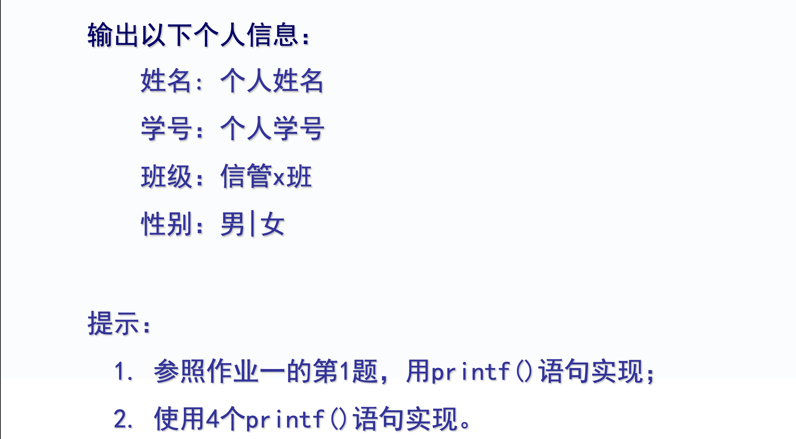
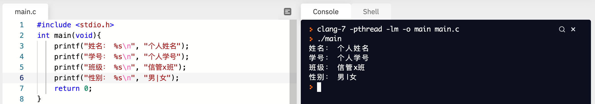

# C 语言格式输出函数 printf() 详解

你好，我是悦创。

<font color="red">**printf 函数称为格式输出函数，其关键字最末一个字母 f 即为“格式”(format)之意。**</font>其功能是按用户指定的格式，把指定的数据显示到显示器屏幕上。在前面的例题中我们已多次使用过这个函数。


## printf 函数调用的一般形式

printf 函数是一个标准库函数，它的函数原型在头文件 “stdio.h” 中。<font color="red">**但作为一个特例，不要求在使用 printf 函数之前必须包含 stdio.h 文件。**</font>printf 函数调用的一般形式为：

**printf(“格式控制字符串”, 输出表列)**

其中格式控制字符串用于指定输出格式。格式控制串可由格式字符串和非格式字符串两种组成。格式字符串是以%开头的字符串，在%后面跟有各种格式字符，以说明输出数据的类型、形式、长度、小数位数等。如：

- **%d 表示按十进制整型输出；**
- **%ld 表示按十进制长整型输出；**
- **%c 表示按字符型输出等；**
- **％s 用来输出一个字符串；**
- **％f 用来输出实数，以小数形式输出，默认情况下保留小数点6位。**
- **%.100f 用来输出实数，保留小数点100位。**
- **％e 以指数形式输出实数**
- **％g 根据大小自动选 f 格式或 e 格式，且不输出无意义的零。**


非格式字符串原样输出，在显示中起提示作用。输出表列中给出了各个输出项，要求格式字符串和各输出项在数量和类型上应该一一对应。


## printf 函数举例

```c
#include <stdio.h>
int main(void){
    int a=88,b=89;
    printf("%d %d\n",a,b);
    printf("%d,%d\n",a,b);
    printf("%c,%c\n",a,b);
    printf("a=%d,b=%d",a,b);
    return 0;
}
```

输出结果：

```c
88 89
88,89
X,Y
a=88,b=89
```

本例中四次输出了 a、b 的值，但由于格式控制串不同，输出的结果也不相同。

第 3 行的输出语句格式控制串中，两格式串 %d 之间加了一个空格（非格式字符），所以输出的 a、b 值之间有一个空格。第 4 行的 printf 语句格式控制串中加入的是非格式字符逗号，因此输出的 a、b 值之间加了一个逗号。第 5 行的格式串要求按字符型输出 a、b 值。

第 6 行中为了提示输出结果又增加了非格式字符串。


## 实验1-输出指定效果的个人信息



代码实例：

```c
#include <stdio.h>
int main(void){
    printf("姓名： %s\n", "个人姓名");
    printf("学号： %s\n", "个人学号");
    printf("班级： %s\n", "信管x班");
    printf("性别： %s\n", "男|女");
    return 0;
}
```

输出：

```c
姓名： 个人姓名
学号： 个人学号
班级： 信管x班
性别： 男|女
```


